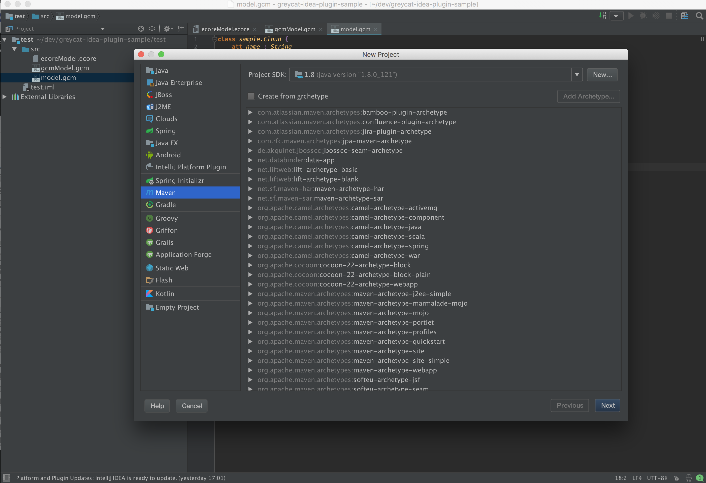
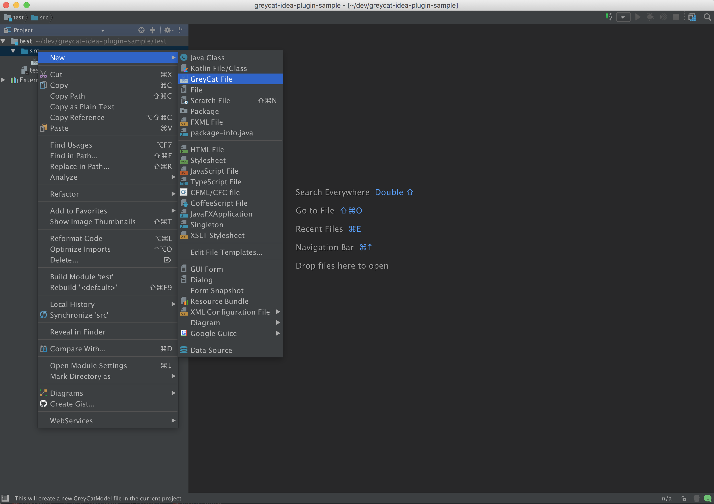
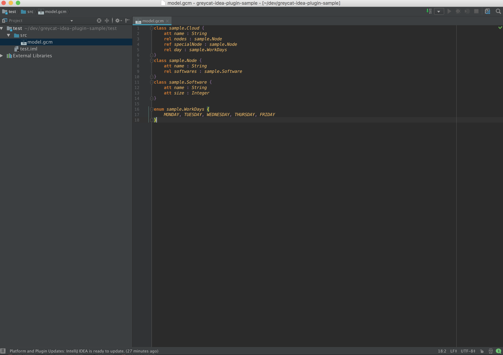

# Getting Started

Here's how to start... 

### Install
First, open IntelliJ and install the GreyCat IDEA plugin.

### Starting from scratch
#### Create a new Maven project.

[Figure 1: Creating a new project](id:fig-new-project)

Then, include the maven dependency to the GreyCat maven plugin.
The generator takes your GreyCat model as input and generates typed GreyCat nodes.   

[Figure 2: Defining the maven dependency to the GreyCat maven plugin](id:fig-new-project)

#### Create a new GreyCat model

[Figure 3: Creating a GreyCat model](id:fig-new-greycat-model)

#### Define your application's domain model

[Figure 4: Defining classes, enums, attributes and relations](id:fig-fieldTypes)

Your domain model consists of classes and enums, just like in most object-oriented languages. 
Inside classes, you can define attributes and relationships.

Attributes must be from one of the primitive types: String, Double, Long, Integer, Boolean, or an array of a primitive type.

GreyCat distinguishes between two different relationships: relations(rel) and references (ref). 
The difference is that a reference is basically a to-one relation whereas a relation is a to-many relation.

#### Indexes

[Figure 5: Defining indexes](id:fig-indexes)

There are two kinds of indexes in GreyCat: 1) global indexes and 2) relation indexes. 
Think of global indexes as entry points and of relation indexes as quick access to large relations. 

### Staring from an existing Ecore model

Create a new project and copy/paste your Ecore model.
Right-click and select `Convert to GCM`.

[Figure 6: Convert & Compile](id:fig-start-from-ecore)

Then you can edit your GreyCat model as usual.